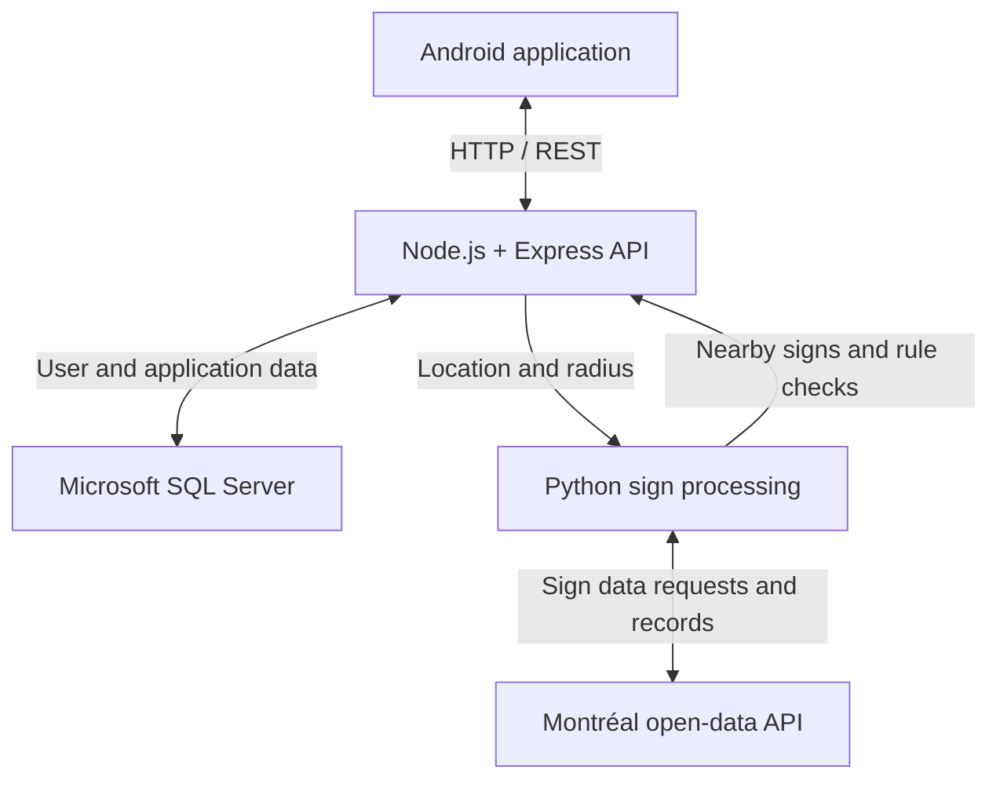

# NAV MTL Backend

NAV MTL is a parking-assistance application built to help drivers navigate Montréal parking restrictions.

This repository contains the **backend API** of the project. The original Android frontend is no longer available in this repository, but the GIF below demonstrates the application in use.


## How Parking Sign Detection Works

NAV MTL connects Montréal's public parking-sign data to the user's location. A Python script retrieves sign records, selects the ones within a requested radius, and analyzes their French descriptions to identify recognized parking restrictions.

### 1. Getting the signs from Montréal's open data

The sign data comes from the City of Montréal's [Signalisation (stationnement sur rue) dataset](https://donnees.montreal.ca/dataset/8ac6dd33-b0d3-4eab-a334-5a6283eb7940).

The script in [router/panneau/panneau.py](router/panneau/panneau.py) uses Python's `requests` library to query the city's `datastore_search` API. It requests sign descriptions and coordinates , with a filter for records whose `DESCRIPTION_REP` is `Reél`.

| Source field | Use in NAV MTL |
| --- | --- |
| `DESCRIPTION_RPA` | Text description of the sign's parking restriction |
| `Latitude` | Sign's latitude |
| `Longitude` | Sign's longitude |
| `DESCRIPTION_REP` | Record status used to select signs marked `Reél` |

### 2. Selecting signs around the user

The Android application sends the user's latitude, longitude, and a search radius to the backend. The Express route in [router/index.js](router/index.js) starts the Python script through `child_process.spawn`, passing those three values as arguments.

For each retrieved sign, the script's `calculer_distance()` function uses the **Haversine formula** to calculate its distance from the supplied location in meters. Only signs whose distance is less than or equal to the requested radius are kept for analysis and returned to the application.

For example, a radius of **500 meters** selects signs up to 500 meters from the user's coordinates. This keeps the sign data sent to the Android map focused on the surrounding area.

The distance filtering happens in Python after the municipal records are fetched. The request to Montréal's API selects the fields and record status; the Python script applies the geographic radius.

### 3. Scanning and interpreting the sign descriptions

For each nearby sign, `verifier_panneau()` scans its description using **spaCy**, the French `fr_core_news_sm` model, regular expressions, and predefined rules.

The script checks for:

* Keywords such as `en tout temps`, `livraison seulement`, `reserve taxis`, and `zone de remorquage`.
* Special categories for motorcycle parking (`MOTOS`) and permit holders (`PERMIS`).
* Recognized months, weekdays, and weekday abbreviations in the description.
* Time ranges written with `h`, such as `9h30` and `17h`.

These checks use the server's current local date and time. The script produces a rule-check result of `True`, `False`, `MOTOS`, or `PERMIS`. A `False` result can also mean that no recognized weekday was found, so it does not by itself establish that parking is allowed.

### 4. Returning the nearby signs

Each selected sign includes:

| Output field | Contents |
| --- | --- |
| `Description_RPA` | Original parking-sign description |
| `Resultat_Verification` | Result of the script's restriction checks |
| `Coordonnees` | Sign's `Latitude` and `Longitude` |

Express forwards the script's output to the Android application, which used the nearby sign data for its interactive map.

### Example request

```http
GET /panneau/run?lat=45.5017&long=-73.5673&radius=500
```

| Parameter | Description |
| --- | --- |
| `lat` | Latitude of the search center |
| `long` | Longitude of the search center |
| `radius` | Search radius in meters |

All three parameters are required. The current route forwards the Python script's printed list as response text.

## Features

The backend supported features including:

* Parking-sign retrieval from Montréal's open-data API
* Radius-based filtering of nearby signs using geographic distance
* Rule-based analysis of French parking-sign descriptions
* User authentication with JWT
* User profiles
* Parking history
* Favorite locations
* Parking alerts
* User settings
* Friend requests and friendships
* User location data
* Communication with the NAV MTL Android application

## Tech Stack

### Backend

* Node.js
* Express.js
* JavaScript

### Parking Data Processing

* Python
* Requests for retrieving municipal sign data
* spaCy with the `fr_core_news_sm` French model
* Regular expressions and custom rules for parsing restrictions
* Haversine distance calculations for geographic filtering

### Database

* Microsoft SQL Server
* Knex.js

### Authentication & Security

* JSON Web Tokens (JWT)
* bcrypt
* dotenv
* express-validator

### Development Tools

* ESLint
* Airbnb JavaScript Style Guide

## Architecture



The Android application communicated with the backend through REST API endpoints for nearby signs, authentication, user data, saved locations, parking history, alerts, and social features. SQL Server stores application data, while the `/panneau/run` route retrieves and processes municipal sign records through Python.

## Database

The backend uses Microsoft SQL Server and includes tables for:

* `utilisateur`
* `favoris`
* `history`
* `parametre`
* `alerte`
* `friend`
* `demandeAmis`
* `friendship`

Relationships between users, favorites, history, alerts, and friendships are maintained using foreign keys.

## Installation

Clone the repository:

```bash
git clone https://github.com/MarvensChery/NavMtl-Backend.git
cd NavMtl-Backend
```

Install Node.js dependencies:

```bash
npm install
```

Install the Python dependencies for sign processing:

```bash
python -m pip install -r requirements.txt
```

The original Python runtime is specified in [runtime.txt](runtime.txt). The backend launches the script using the `python` command, so that command must resolve to the environment containing the dependencies and the `fr_core_news_sm` model included in the requirements.

The script also requires the `fr_FR.UTF-8` locale for French day and month names. Its date and time checks use the server's local clock, so configure the host for Montréal time when running the application.

Create a `.env` file and configure the required environment variables for the database connection.

Then start the server:

```bash
npm start
```

## Linting

Run ESLint and automatically fix supported issues:

```bash
npm run lint
```

## Main Dependencies

* `express`
* `mssql`
* `knex`
* `jsonwebtoken`
* `bcrypt`
* `express-validator`
* `dotenv`
* `cors`
* `requests` (Python)
* `spacy` (Python)
* `fr_core_news_sm` (French spaCy model)

## Project Context

NAV MTL was developed as a collaborative software project.

The complete application originally included an Android frontend with an interactive map and parking-related functionality. This repository preserves the backend portion of the project.

## Authors

**Marvens Chery**

* [LinkedIn](https://www.linkedin.com/in/marvenschery/)
* [GitHub](https://github.com/MarvensChery)

**Christopher Trang**

* [GitHub](https://github.com/christrang)

## Security

Sensitive configuration such as database credentials and JWT secrets should be stored in environment variables and must not be committed to the repository.
